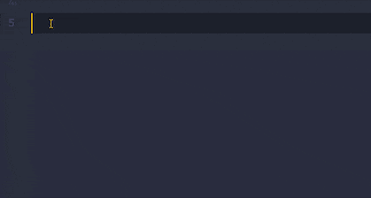
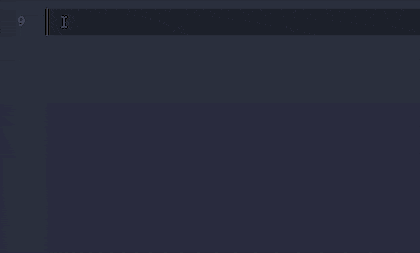

# markdown-formatter

[中文文档](./README_CN.md)

## Introduction

This is a tool to improve the writing efficiency of markdown, not only provides a relatively uniform format for the `markdown` user, but also provides some snippets.

## Instructions

After the installation is complete, you may need to restart your vscode.

In any `markdown` standard file with a `.md` suffix, you can use `shift+option+f` to quickly format the code.


> PS: It does not fix your markdown syntax errors. for example, there is no space after `#` as a title, because in the code `#` is a usable character that is widely used as a comment or variable declaration.

## Feature

### Snippets part

#### import image

Typing `img` 


#### import table

Typing `tab` 



#### import code

Typing `js` , `html` , `css` , `python` , `go` , `java` , or `code` 



#### import list

Typing `ul` or `ol` 


### Formatter part

#### symbols

* For `，,。;；！、？：` add a space after these symbols; 
* `，：；！“”‘’（）？。` , unify it as a half-width character(Optional); 
* `.!?` add a space after these symbols, if before uppercases or chineses; 
* Supports converting Chinese symbols into full-width symbols according to context, or converting English into half-width symbols; 
* a space before and after the back-quote, which wrapped by back-quote will not be formatted; 

#### line

* Empty a line for the title; 
* Empty a line for the code block; 
* The table is aligned automatically; 
* Empty a line for the link block; 
* erase dulicated line; 

#### table


#### list

##### unordered list

``` markdown

* 大标题
    + 中标题
        - 小标题

```


#### code

Format the code, by `js-beautify` tool, currently only the `javascript` , `html` and `css` language; 

##### code area

    function sayHello() {
      console.log('hello')
    }

Will always be formatted according to js syntax, if `codeAreaFormat` is `true` (default)

##### code block

```lang
function sayHello() {console.log('hello')}
```

1. If `lang` is `js` or `javascript` or empty, it will be formatted according to js syntax.
2. If `lang` is `html` , it will be formatted according to html syntax.
3. If `lang` is `css` , it will be formatted according to css syntax.
4. If you don't use `js` usually, You can disable code block or code area autoformat code by setting the parameter `formatOpt` to false.

> The js formatting rules can be configured in `settings.json` .

> Code blocks can clearly mark the type of language, so it is recommended to use code blocks, you can configure `codeAreaToBlock` to set the conversion method.

## Config

```typescript
// enable/disable markdown-formatter
enable = config.get <boolean> ('enable', true); 
// automatically format the code area or not
codeAreaFormat = config.get<boolean>('codeAreaFormat', true); 
// fullwidth character translate into halfwidth character, such as `，：；！“”‘’（）？。`
// Automatically convert symbols based on context when set to 'auto'
// Don't convert symbols based on context when set to '_' or ''
fullWidthTurnHalfWidth = config.get<string>('fullWidthTurnHalfWidth', 'auto');
// Convert code block to code area, and the default is not converted. 
// You can set it by any meaningful strings
// if it is set to js, it will be formatted according to the js language syntax.
codeAreaToBlock = config.get<string>('codeAreaToBlock', '');
// enable/disable format code or config beautifyjs
// false: disable format code 
// {}: config beautifyjs
formatOpt = config.get <any> ('formatOpt', {}); 
// Format the symbols of the unordered list
// * > + > -
formatULSymbol = config.get<boolean>('formatULSymbol', true);
// Whether a space is required after the full-width symbol
spaceAfterFullWidth = config.get<boolean>('spaceAfterFullWidth', false);
```

How to config `beautifyjs` , you can click[here](https://github.com/beautify-web/js-beautify)

You can refer to my configuration:

```js
  // markdown-formatter conf
  "markdownFormatter.codeAreaFormat:": true,
  "markdownFormatter.fullWidthTurnHalfWidth": "auto",
  // "markdownFormatter.fullWidthTurnHalfWidth": "，：；！“”‘’（）？。",
  "markdownFormatter.formatOpt": {
    "indent_size": 2
  },
  "[markdown]": {
    // 自动保存
    "editor.formatOnSave": true,
    // 显示空格
    "editor.renderWhitespace": "all",
    // 快速补全
    "editor.quickSuggestions": {
      "other": true,
      "comments": true,
      "strings": true
    },
    "editor.snippetSuggestions": "top",
    "editor.tabCompletion": "on",
    "editor.acceptSuggestionOnEnter": "on"
  }
```

## Software version and development environment

#### develop version

VSCode version 1.29.1 (macOS Mojave)

#### test version

VSCode version 1.33.1 (macOS Mojave)

## Contact

If you have any ideas, please contact me.

If you know how to format other languages using front-end libraries, please let me know.

email: mydiamervin@gmail.com  or [here](https://github.com/sumnow/markdown-formatter/issues)

