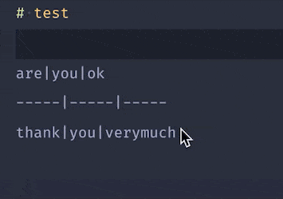
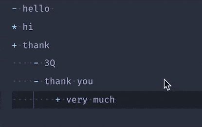

# markdown-formatter

[中文文档](./README_CN.md)

## Introduction

This is a tool to improve the writing efficiency of markdown, not only provides a relatively uniform format for the `markdown` user, but also provides some snippets.

## Instructions

After the installation is complete, you may need to restart your vscode.

In any `markdown` standard file with a `.md` suffix, you can use `shift+option+f`(osx) or `ctrl+shift+f`(window) to quickly format the code. 


> PS: It does not fix your markdown syntax errors. for example, there is no space after `#` as a title, because in the code `#` is a usable character that is widely used as a comment or variable declaration.

## Feature

### Snippets part

**First of all, You must config like this in `settings.json`**

```js
"[markdown]": {
  // 快速补全
  "editor.quickSuggestions": {
    "other": true,
    "comments": true,
    "strings": true
  },
}
```

#### import image

Typing `img` 


#### import table

Typing `tab` 


#### import code

Typing `js` , `html` , `css` , `python` , `go` , `java` , or `code` 


#### import list

Typing `ul` or `ol` 


### Formatter part

#### symbols

* For `，,。;；！、？：` add a space after these symbols; 
* `，：；！“”‘’（）？。` , unify it as a half-width character(Optional); 
* `.!?` add a space after these symbols, if before uppercases or chineses; 
* Supports converting Chinese symbols into full-width symbols according to context, or converting English into half-width symbols; 
* a space before and after the back-quote, which wrapped by back-quote will not be formatted; 

#### line

* Empty a line for the title; 
* Empty a line for the code block; 
* The table is aligned automatically; 
* Empty a line for the link block; 
* erase dulicated line; 

#### table



#### list

##### unordered list

``` markdown

* TITLE
  + Title
    - title

```




#### code

Format the code, by `js-beautify` tool, currently only the `javascript` , `html` and `css` language; 

##### code block

```lang
function sayHello() {console.log('hello')}
```

1. If `lang` is `js` or `javascript` or empty, it will be formatted according to js syntax.
2. If `lang` is `html` , it will be formatted according to html syntax.
3. If `lang` is `css` , it will be formatted according to css syntax.
4. If you don't use `js` usually, You can disable code block or code area autoformat code by setting the parameter `formatOpt` to false.

> The js formatting rules can be configured in `settings.json` .

> Code blocks can clearly mark the type of language, so it is recommended to use code blocks, you can configure `codeAreaToBlock` to set the conversion method.

##### code area

The default is not formatted. If `codeAreaToBlock` is any language name, such as `js` or `go`, it will be converted into a code block and then formatted.


**Tips: Empty lines in the code area cannot exceed one line.**


## Config

```typescript
// enable/disable markdown-formatter
enable = config.get <boolean> ('enable', true); 
// fullwidth character translate into halfwidth character, such as `，：；！“”‘’（）？。`
// Automatically convert symbols based on context when set to 'auto'
// Don't convert symbols based on context when set to '_' or ''
fullWidthTurnHalfWidth = config.get<string>('fullWidthTurnHalfWidth', 'auto');
// Convert code block to code area, and the default is not converted. 
// You can set it by any meaningful strings
// if it is set to js, it will be formatted according to the js language syntax.
codeAreaToBlock = config.get<string>('codeAreaToBlock', '');
// enable/disable format code
// false: disable format code
formatCodes = config.get<boolean>('formatCodes', true);
// config beautifyjs
// {}: config beautifyjs
formatOpt = config.get<any> ('formatOpt', {}); 
// Format the symbols of the unordered list
// * > + > -
formatULSymbol = config.get<boolean>('formatULSymbol', true);
// Whether a space is required after the full-width or half-width symbol
spaceAfterFullWidthOrHalfWidth = config.get<string>('spaceAfterFullWidthOrHalfWidth', 'half');
```

How to config `beautifyjs` , you can click[here](https://github.com/beautify-web/js-beautify)

### configuration example

You can refer to my configuration:

```js
// settings.json
// markdown-formatter conf
// Convert the code area of unnamed language into code block according to js type
// "markdownFormatter.codeAreaToBlock": "js",
// or not
"markdownFormatter.codeAreaToBlock": "",
// format punctuation automatically
"markdownFormatter.fullWidthTurnHalfWidth": "auto",
// Chinese punctuation formatted to English
// "markdownFormatter.fullWidthTurnHalfWidth": "，：；！“”‘’（）？。",
"markdownFormatter.formatOpt": {
  "indent_size": 2
},
"[markdown]": {
  // auto save
  "editor.formatOnSave": false,
  // show space
  "editor.renderWhitespace": "all",
  // 
  "editor.quickSuggestions": {
    "other": true,
    "comments": true,
    "strings": true
  },
  // 
  "editor.snippetSuggestions": "top",
  "editor.tabCompletion": "on",
  // 
  "editor.acceptSuggestionOnEnter": "on",
  // 
  "editor.defaultFormatter": "mervin.markdown-formatter"
}
```


## Software version and development environment

#### develop version

VSCode version 1.29.1 (macOS Mojave)

#### test version

VSCode version 1.33.1 (macOS Mojave)

## Contact

If you have any ideas, please contact me.

If you know how to format other languages using front-end libraries, please let me know.

email: mydiamervin@gmail.com  or [here](https://github.com/sumnow/markdown-formatter/issues)


## Gratitude

Thank you for helping me improve this tool.

* [whidy]
  + Bug(https://github.com/sumnow/markdown-formatter/issues/41)
* [ddejohn]
  + Bug(https://github.com/sumnow/markdown-formatter/issues/35)
* [jackfirth]
  + Bug(https://github.com/sumnow/markdown-formatter/issues/35)
* [fruh]
  + Bug(https://github.com/sumnow/markdown-formatter/issues/36)
* [ddejohn]
  + Bug(https://github.com/sumnow/markdown-formatter/issues/31)
* [vio1etus]
  + Bug(https://github.com/sumnow/markdown-formatter/issues/29)
* [zybieku]
  + Bug(https://github.com/sumnow/markdown-formatter/issues/27)
* [rowild]
  + Bug(https://github.com/sumnow/markdown-formatter/issues/24)
* [tifDev](https://github.com/tifDev)
  + Bug(https://github.com/sumnow/markdown-formatter/issues/28)
  + Bug(https://github.com/sumnow/markdown-formatter/issues/23)
  + Bug(https://github.com/sumnow/markdown-formatter/issues/22)
* [lartpang](https://github.com/lartpang)
  + Bug(https://github.com/sumnow/markdown-formatter/issues/18)
* [lancerXXXX](https://github.com/lancerXXXX)
  + Bug(https://github.com/sumnow/markdown-formatter/issues/20)
  + Bug(https://github.com/sumnow/markdown-formatter/issues/16)
* [rgeorgiev583](https://github.com/rgeorgiev583)
  + Bug(https://github.com/sumnow/markdown-formatter/issues/14)
* [Ardeshir81](https://github.com/Ardeshir81)
  + Bug(https://github.com/sumnow/markdown-formatter/issues/13)
* [busyrat](https://github.com/busyrat) 
  + Feature(https://github.com/sumnow/markdown-formatter/issues/10)
* [lartpang](https://github.com/lartpang) 
  + Bug(https://github.com/sumnow/markdown-formatter/issues/15)
  + Feature(https://github.com/sumnow/markdown-formatter/issues/11)
  + Bug(https://github.com/sumnow/markdown-formatter/issues/9)
  + Bug(https://github.com/sumnow/markdown-formatter/issues/8)
  + Bug(https://github.com/sumnow/markdown-formatter/issues/7)
  + Bug(https://github.com/sumnow/markdown-formatter/issues/6)
  + Bug(https://github.com/sumnow/markdown-formatter/issues/5)
* [iostalks](https://github.com/iostalks)
  + Feature(https://github.com/sumnow/markdown-formatter/issues/3)
* [zhuoyan](https://github.com/zhuoyan)
  + Bug(https://github.com/sumnow/markdown-formatter/issues/1)


> Sorting only according to the time of the question

